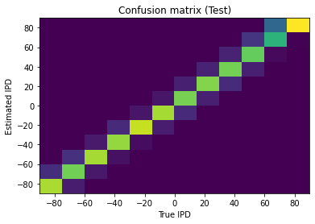
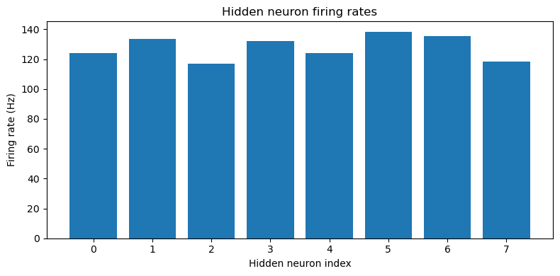

# Organising the paper

We are currently in the process of writing up the paper. If you are one of the contributors and you would like to be recognised as an author on this paper, please make yourself known to us. Either email [Dan Goodman](mailto:d.goodman@imperial.ac.uk) or join the [SNUFA discord channel](https://discord.gg/aYvgGakrVK) ``#sound-localisation-paper`` (or both).

The current plan for writing up the paper is as follows:

1. Gather information on all contributors (names, email addresses, institutions, etc.). Current plan is that Marcus will be first author, I will be last author, and no decision about author ordering other than that. Please give your thoughts, including whether or not you disagree with the first/last author places (this is fine if you disagree, it's just a temporary decision). If nobody has strong feelings we may just randomise the rest of the order.
2. Clean up and merge all notebooks into main. Please note that I have renamed some of the notebooks, moved some into the research folder, and changes the headings on some to give them better descriptions. You may have conflicts that need resolving in your pull request.
3. Marcus and I will write a first draft of the main body of the paper that will attempt to summarise everything as well as talk about the process. You can see the results so far online as we write.
4. If you want to do a write up of your section in more detail including methods, results, etc. these will be included in the Appendices part of the paper.
5. Every notebook will be included in the Supplementary Materials section of the paper.
6. I am happy to discuss any of the decisions above. I've only made them in order to get things going quickly!
7. We'll do several rounds of iteration and comments. We will also continue our monthly meetings and discuss at those.
8. We'll submit a preprint of the paper to arXiv or bioRxiv.
9. We'll try to get this submitted to a journal.

## Actions

```{attention} Action 1: update contributor table with your information, and join Discord or email Dan
```

```{attention} Action 2: clean up and merge your notebooks
```

```{attention} Action 3: participate in writing up the paper
```

## Referencing

If contributing to the paper, it helps if we all stick to a standard way of doing referencing (citations and internal references).

Code for figures should look something like this:

````
```{figure} ../research/diagrams/arch-stimuli.png
:label: basic-arch
:width: 100%

Overall model architecture.
```
````

The path is relative to the file ``paper/paper.md``. You can reference this figure in the text by writing something like:

````
See {ref}`basic-arch`
````

You can even do subpanels of figures and reference those, e.g.:

````
```{figure}
:label: basic-results
:width: 100%

(confusion-matrix)=


(hidden-firing-rates)=


Results of training the network with $f=50$ Hz, $\tau=2$ ms, $N_\psi=100$, $N_h=8$, $N_c=12$. Mean absolute IPD errors are $\sim 2.6$ deg.
```
````

You can do label and reference section headings, which might look like this:

````
(basic-model)=
## A minimal trainable model of IPD processing
````

and referenced as

````
See {ref}`basic-model`
````

For papers, include the paper in ``paper.bib`` using standard BiBTeX notation, and then reference in one of the following ways:

````
[@Zenke2018] - single reference will look like (Zenke et al. 2018).
[@Zenke2018;Yin2019] - multiple references (don't do [@Zenke2018][@Yin2019] which will look ugly).
{cite:t}`@Zenke2018` will look like Zenke et al. (2018) for referencing as part of a sentence.
````

## Current known contributors

```{note} On this page, not all links to sections of the paper work, [follow this link for the working version](./paper.md#contributors).
```

```{attention}
Hello contributors! I have inserted a table of names, websites and GitHub usernames of contributors from the repository below. There is a lot of information missing. Please can you submit pull requests modifying the file [paper/sections/contributor_table.md](https://github.com/comob-project/snn-sound-localization/blob/main/paper/sections/contributor_table.md) to update your information, and also get in touch with us if you would like to be listed as an author. Either email [Dan Goodman](mailto:d.goodman@imperial.ac.uk) or join the [SNUFA discord channel](https://discord.gg/aYvgGakrVK) ``#sound-localisation-paper``.
```

If you add a contribution, please use one of the following templates (see examples below):

* Wrote the paper (plus which section if you would like to specify)
* Conducted research (please give a link to your notebook formatted like this ``[](../research/3-Starting-Notebook.ipynb)``, or specify another sort of contribution)
* Supervised research (please give the name of your supervisee)

```{include} sections/contributor_table.md
```

## Notebook map

```{note} On this page, not all links to sections of the paper work, [follow this link for the working version](./paper.md#notebook-map).
```

```{include} sections/notebook_map.md
```
