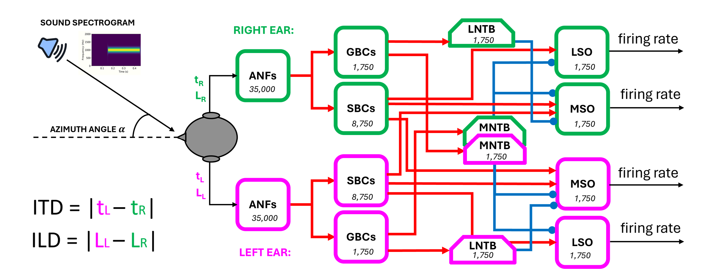

## Contralateral glycinergic inhibition as key factor in creating ITD sensitivity

### Intro
Why a more biological inspired model? 
- Existence of both ITDs and ILDs for azimuthal sounds localization
- Problem of ITD sensitivity: their duration is in the range of microseconds whereas neuronal dynamics work in the millisecond range.
- Jeffress model existence in mammals is not sure
- axonal delay lines absence in mammalian MSO
- peaks of MSO responses only for contralateral sounds, outside physiological range? Slopes as the encoding part of the curves
- experiments with inhibition blocked (glycine antagonist strychnine) show loss of ITD-coding in the MSO principal cells (see 10.1523/JNEUROSCI.1660-08.2008)

### Introduction Text 
For the vast majority of animals, sound localization is realized through two classes of hidden acoustic cues: binaural and spectral cues. In humans, binaural cues alone are sufficient to discriminate azimuth angles between 0-180 degrees, whereas psychoacoustic evidence has shown how spectral cues have a role in the solution of front-back ambiguities and in angle recognition along the vertical plane (i.e. elevation angles) []. Focusing on binaural cues, the two main signals exploited by different animals in creating an acoustic spatiality are interaural time and level differences (ITDs and ILDs). Their role and their dominance over each other depend mainly on animal head size and hearing range in terms of frequencies. 
It is clear at first glance how ITDs assume significant values for species with large head sizes while being much smaller, and so much harder to neuronally encode, for smaller animals. ILDs on the other hand occur when the wavelength of the sound stimulus is shorter than the size of the animal's head, which then generates a significant attenuation at the contralateral ear. For this reason, ILDs' significance with respect to ITDs' is greater in smaller animals with a middle ear specialised for the transmission of high frequencies. This was the case with early mammals, which in fact only developed structures dedicated to processing ILDs.
Even today, many small mammals rely exclusively on ILDs to perform sound localization and the main neural structure involved in the processing of this cue is the Lateral Superior Olive (LSO), a nucleus placed within the superior olivary complex in the mammalian brainstem. Only afterwards, the selective pressure has led some species to evolve a second specialized structure, the Medial Superior Olive (MSO), for the processing of ITDs solely. This was probably due to an increase in body size that provided production of low-frequency communication calls [].
Humans, whose hearing range is shifted towards lower frequencies with respect to many mammals, possess both a large LSO and a well-developed MSO. As a matter of facts, psychoacoustic evidence has shown how both ITDs and ILDs are used for horizontal sound localization. In particular, the MSO can be considered as a refined processing stage with respect to the LSO for the localization of low frequency sounds, at which ILD cues are not available.

That’s why, to understand how ITD sensitivity emerges in mammalian MSO, we have first to briefly describe the coding strategy for ILDs happening in the LSO. 
LSO principal cells have a bipolar dendritic tree that receives excitatory input from the ipsilateral ear and inhibitory input from contralateral one. All mammals appear to apply one common neural strategy for processing ILDs, which consists of a subtraction process between these two inputs.  For instance, neurons in the right LSO will be more excited when sound arrives from the right and more inhibited when sound arrives from the left. The function that describes LSO neurons’ firing rate according to different azimuth angles is usually a sigmoid, presenting highest values for sound coming from the hemispace ipsilateral to the nucleus, with a steep slope centered on frontal angles, suggesting a rate-coding strategy for identifying different ILD values. Although the on-off nature of this strategy, for which exquisite timing of inhibitory influences appears not to be a key prerequisite, the two major inputs to the LSO are specialized for high-fidelity temporal transmission. An explanation is found in the fact that the subtraction process happening in LSO principal cells is realized in a phase-locked way with respect to the stimulus. This implies a purely suppressive coincidence mechanism happening at each period of the phase-locked inputs to the LSO (spiking occur unless binaural coincidence is happening).
The MSO, on the other hand, receives two additional inputs compared to the LSO: a contralateral excitation and an ipsilateral inhibition. As a result of experimental observations, the main hypothesis is that the combination of these four inputs have converted the suppressive coincidence mechanism present in the LSO into an excitatory coincidence one for the detection of ITDs in the MSO (spiking occur only if binaural coincidence is happening) [].
Nevertheless, the most important model that attempts to explain the functioning of the MSO, namely the Jeffress model, considers only the two excitatory inputs arriving to the MSO, assuming an array of labelled neurons providing binaural coincidence detection for specific values of ITDs, due to the presence of axonal delay lines that can create this type of sensitivity.
For many years, Jeffress's remained the most accepted proposal, given the discovery of axonal lines potentially similar to those theorised by Jeffress in the Nucleus Laminaris (NL) of different bird species. However, the presence of similar delay lines in the mammalian MSO, analogous to the avian NL, has never been demonstrated. [] 
The first steps into a better understanding of the MSO functioning were made thanks to the work of Brand et al, [] in which the analysis of in vivo recordings from the MSO of the Mongolian gerbil shown how all the 20 neurons tested responded maximally to sounds leading in time at the contralateral ear. Peaks in the firing rate of these neurons were found also for ITD values higher than the highest possible ones generated by the gerbil head, which correspond to almost 120 us for a sound coming at 90 degrees angle from the contralateral hemispace. This observation led to the hypothesis that peaks in these neurons firing rate were not coding for a specific ITD value in gerbil relevant physiological space, suggesting instead a mapping made by the slopes in the activity curves, in a way similar to the rate-coding strategy adopted for ILDs in the LSO  (even if the slopes in LSO cells response increases from contralateral ILD values going towards ipsilateral ones, oppositely from what happens in MSO cells response). The idea of a topographic map at the level of the MSO portrayed by different peaks in cells activity risks then to be discarded in favour of a less refined rate-coding strategy, in which recognition of the ITD value generated by an input sound should occur at a higher level, following integration on the activity of a population cluster.
The same study of Brand et al, together with a following one by Pecka et al [], explored also the physical mechanisms underlying the shift in peaks activity towards contralateral ITD values. Since the presence of axonal delay lines had been discarded, there had to be another neural mechanism capable of compensating for the external ITD value, causing a growth in the activity of MSO neurons for gradually more and more contralateral sounds. The results shown how the two inhibitory inputs to the MSO, which were discarded in the Jeffres model, had instead a central role in this process. By blocking the glycinergic inhibition to the MSO neurons by means of the application of its antagonist, strychnine, it was observed the loss of the peak shift in all their response activity. Having now a symmetry in all the neuron responses, with a peak in the activity corresponding to null ITD values (and so to a 0° azimuth angle), all the information present in the MSO responses had been lost. Inhibition have thus a central role in identifying the ITD values in the MSO, whether that the coding strategy adopted consists in a peak-coding or in a rate-coding one. However, even in this case, although numerous proposals have been made, it is still unclear how the two inhibitory inputs manage to cause this higher excitability of MSO neurons for contralateral sounds.
Some experimental studies have reported how inhibitory inputs, especially the contralateral one, can arrive slightly in advance of the excitatory inputs from the corresponding sides, thus going to influence the way ipsilateral and contralateral inputs add up in the MSO neurons and thereby generate a maximum response for contralateral ITD values. Nevertheless, other work has characterized the hypothesis of anticipation of inhibitory inputs as implausible. For this reason, in our work, we explored the validity of another hypothesis related solely to the shape of post-synaptic potentials (PSPs), both excitatory and inhibitory, by going to test different sets of time constants that then govern the shape of PSPs.

### Methods
Inspired by the neurophysiological data, we implemented a complex spiking neural network in Python using the NEST Simulator framework. The different neuronal populations composing the brainstem circuit and their interconnections are depicted in <a href="#network-diagram">Figure 1</a>.

<em>The end-to-end system with the network diagram</em>

The principal inputs to the network are the spectrogram of a sound stimulus arriving at both ears and the azimuth angle from which univocal values of ITD and ILD are computed. With regards to the spectrogram, we covered the whole human audible range of sound between a minimum frequency of 20 Hz and a maximum of 20 kHz. We subdivided it into 3500 channels since this value is the most likely estimate of the number of inner hair cells (IHCs) present in the human cochlea. With the intent to mimic the physiological distribution of IHCs along the basilar membrane, the width of each frequency channel was not constant throughout the range but grew exponentially []. 
For modelling of the auditory nerve fibers (ANFs) we used the pulse_packet_generator, a build-in NEST device that produces a spike train containing Gaussian spike clusters centered about given times. 
These devices mimic the actual behavior of ANFs subjected to a pure tonal stimulus, which, like all other neuronal populations involved in sound processing, manifest a phase-locked response. The firing of these neurons tends to occur only at a certain restricted phase of the incoming sine wave of sound, due to the working principle of the inner hair cells placed in the cochlea [1]. pulse_packet_generator allowed us to define the number of spikes in each packet with random shifts normally distributed with respect to the central time of the pulse.
This allowed us to implement ILDs by varying the spikes_number parameter according to the input azimuth angle. A source of noise was introduced by setting the standard deviation of the random displacement from the centre of the pulse equal to 0.1 ms.
The value of ITD was instead computed considering the interaural path difference, which is the difference between the paths travelled by the sound starting from the source and arriving at the two ears and dividing it by the speed of sound in air (i.e., 330 m/s). 
All other cell populations were implemented in a manner faithful to their biological counterparts, starting with the bushy cells (spherical and globular, SBCs and GBCs) located in the antero-ventral part of the cochlear nuclei, proceeding to the glycinergic neurons located in the medial and lateral trapezoidal body (MNTB and LNTB), and finally to the main cells of the medial and the lateral superior olives (MSO and LSO).
The MSO principal cells were modelled trough iaf_cond_beta model, a simple implementation of a spiking neuron in NEST using integrate-and-fire dynamics with conductance-based synapses. In this model, incoming spike events induce a postsynaptic change of conductance modelled by a beta function. The use of a beta function allowed us to change independently the time constants of rise and fall of the conductance change and thus to modify both the excitatory and inhibitory post-synaptic potential shapes in the MSO. In this way, we could explore different set of values and attempt to validate our hypothesis about how inhibitory inputs are able to code for different ITD values in MSO cells [see Introduction].
All the other neuronal populations, except for ANFs and MSO cells, were modelled with the iaf_cond_alpha, since there was no need for modifying the PSPs shape of their inputs.
For the validation of the complete brainstem network, including both LSO and MSO of both sides, sound stimuli with frequencies of 100 Hz and 1 s duration from different spatial positions were tested. Specifically, we gave the model azimuth angles ranging from -90° to +90° with an interval of 15°. 

The MSO response was tested both in physiological conditions and with blocked inhibitory inputs, as in the experiments of Brand et al. and Pecka et al.

### Results 
The responses in terms of average firing rate for varying the azimuth angle from which the 100 Hz pure tone arrives are shown in figure []. 
As for the LSO response, in our results we obtained the desired subtraction process described in [Introduction]: considering for sake of simplicity the right LSO, when the sound arrives from a source placed at -90°, the contralateral ear (left) receives sounds earlier and more intensely than the ipsilateral one (right). As the azimuth angle proceeds toward 0° (frontal position), the firing rate increases while maintaining a constant slope. This steep segment is the most informative part of the right LSO response curve, as a high sensitivity to changing input azimuth angles is guaranteed. Once past 0°, the firing rate ceases to increase steadily, and the response flattens out to high-rate values. Here, the ipsilateral (right) excitation dominates due to louder sounds arriving to the contralateral ear.
Regarding instead the MSO, the different curves represent the activity of neurons in which we varied only the value of tau_decay, so changing the time constants of the decay time in the conductance change generated by an input over time, both excitatory and inhibitory. We observed that different combination of these two values (tau_decay_exc and tau_decay_inh) provided coding for a specific angle (and thus an ITD value) achieved by the presence of a peak in that cell's activity. As observed experimentally, all peaks were present in the contralateral sound-space, thus confirming the hypothesis that, in contrast to the coding strategy applied in the LSO, higher activity is present in the MSO for sounds from contralateral space.

Regarding simulations in which the MSO receives only excitatory inputs, a loss in the coding of different contralateral angles is evidenced by a symmetric firing-rate curve, with all the peak values being higher and shifted towards 0° angles with respect to the physiological activity, as measured experimentally in [].

The achievements of this work are to be considered significant in the investigation of the mechanisms used by the mammalian brainstem to perform sound localization. The computational model developed is in fact a good validation platform for the most recent theories concerning the processing of the two binaural cues, ITDs, and
ILDs. This model has shown how the integration of information from LSO and MSO allows for more accurate localizations than the responses of the two nuclei taken individually, at least for pure tones of 100 Hz frequency. The peak-coding strategy applied for the identification of contralateral angles in each MSO can be considered a refinement of the rate-based localization of sounds happening in the LSO. As described in the [Introduction], this type of redundancy is also justified by the evolutionary history of spatial hearing mechanisms in mammals. In contrast to birds, where ITDs have always been used as the main binaural cue for sound
localization, early mammals first made exclusive use of ILDs as acoustic cues and only later developed a sensitivity to different ITDs, created in tandem with the development of more dedicated low-frequency hearing. This leads to the possible conclusion that strategies similar to those used for the processing of ILDs have also
been readapted for the processing of ITDs, and that in the brainstem of modern mammals these two processes occur in parallel, merging at a higher level and thus providing a more refined and complete spatial map.
